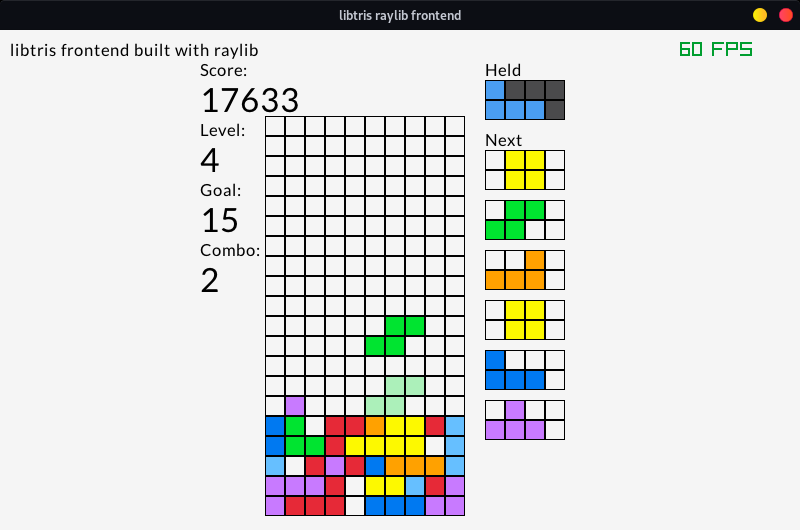

# libtris examples

## raylib
There's only one example at the minute.  This is a basic frontend for libtris built using [raylib](https://www.raylib.com/).  Here's a screenshot of it:


### Building
Because it isn't a very complicated example, there isn't a Makefile.  You can use the following command in this directory to compile the example (assuming that raylib has been installed correctly:)
```
g++ -o tetris tetris_raylib.cpp $(pkg-config --libs raylib) -L/src/ -g   
```
I've only tested this on Linux, so the process may be a bit different on macOS and Windows.

### Playing
This example tries to implement the standard controls set out by the Tetris Guidelines:
|------------------|----------------------------------------|
| Key              | Action                                 |
|------------------|----------------------------------------|
| Left             | moves tetrimino left                   |
| Right            | moves tetrimino right                  |
| Down             | moves tetrimino down                   |
| Up               | rotates tetrimino clockwise 90 degrees |
| Space            | hard drop (locking)                    |
| Left Shift / C   | holds tetrimino                        |
| Escape           | pauses game                            |
| F4               | toggle fullscreen                      |

the last two aren't standard, and anticlockwise rotation hasn't been implemented yet.